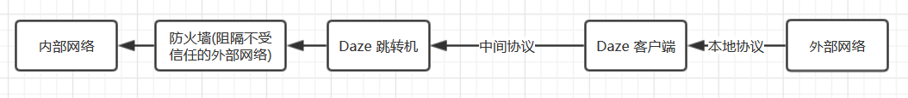

# Daze 是什么?

Daze 是一款用于网络防火墙的辅助工具. 使用网络防火墙, 系统可以有效地将内部网络(如公司网络和家庭网络)从外部网络结构中隔离出来. 但是这通常面临一个问题: 运营人员需要频繁的更新允许/禁止穿过网络防火墙的人员名单. Daze 通过提供一个中间跳转机的形式, 有效的简化了从外部网络(如 Internet)访问受防火墙保护的内部网络的流程.

# 原理



Daze 由两部分组成, 分别是 Server 与 Client. 其中 Server 部署在拥有访问内部网络权限的机器之上, 而 Client 则负责转发公网流量到 Server. 因此, Client 端无需拥有通过防火墙的权限而仅需拥有链接 Server 的权限即可访问内部网络.

**本地协议**: Daze 支持三种本地协议, 分别是 `socks5`, `http` 与 `https`. 他们均是 RFC 标准协议之一, 因此请对使用他们感到轻松愉快--通常情况这些标准在可预见的未来内不会发生任何改变. 一个好消息是, Client 会根据流量自动判断本地协议的版本或类型.

**中间协议**: 中间协议的目的是为了进行流量加密. 如你所见, Daze 会加密 Client 到 Server 端的所有流量, 因为在大部分情况下, 被运营商挟持并修改 HTTP 格式的协议是令人不愉快的. Daze 采用 OTA(一次性验证, 即单个密码仅使用一次) + 流加密协议形式对抗不怀好意的攻击者.虽然无法保证绝对的安全, 但这种设计真的很厉害!

当前支持的中间协议格式:
- [x] ashe(亡国公主). 基本的数据通信与加密.
- [x] asheshadow(幽灵公主). 在亡国公主基础增加 HTTP 混淆.

# 安装与使用

```sh
go get -u -v github.com/mohanson/daze/cmd/daze

# server port
daze server -l 0.0.0.0:51958

# client port
daze client -s $SERVER:51958 -l 127.0.0.1:51959
```

以火狐浏览器为例, 您需要在`选项`, `网络代理`中选择`手动配置代理`, 在 SOCKS 一栏中填入 `SOCKS 主机: 127.0.0.1`, `端口 51959`, 选择 `SOCKS v5` 协议并勾选 `用 SOCKS v5 代理 DNS`. 至此为止, 就可以在外部网络畅通访问公司内部网络了.
